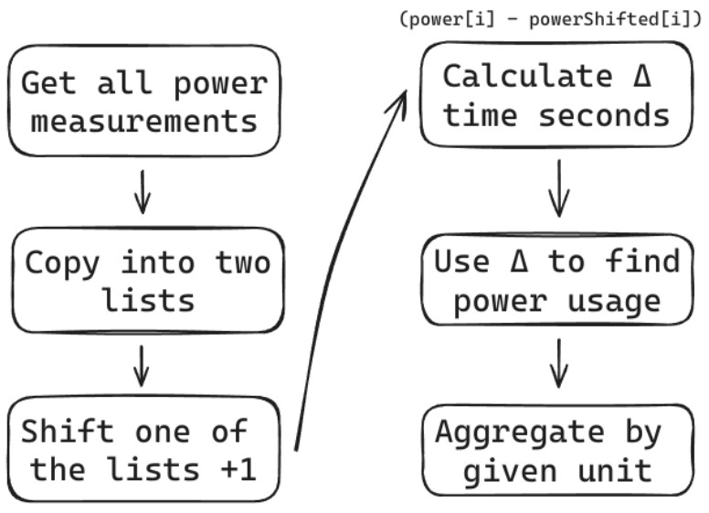
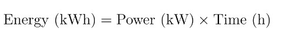
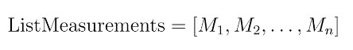
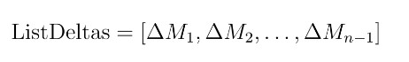
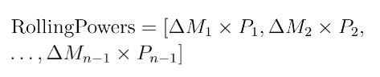
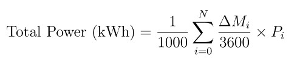

<p align="center">
    
</p>

# Overview

This is the business logic component for Paddy, the Power Administration Daemon. It exposes HTTP & MQTT controllers.

It uses [Quarkus, the Supersonic Subatomic Java Framework](https://quarkus.io/) running Java 17, is written in Kotlin, and is deployed in Docker.

The job of this application is to provide a bridge between the Paddy App && the Daemons. It accomplishes these tasks as such:

1. Exposes a HTTP API to be called by the Paddy App.
2. Exposes a MQTT API to be called by the Daemons (through the broker).
3. Connects to a neo4j cluster/standalone DB && stores information regarding the user and Daemons.
4. Interfaces with the Daemons directly by publishing MQTT messages on the broker.

# Message Router

Writing imperative code to create a router usually leads to the codebase being littered with control flow statements. While there are many ways to invert control in this situation, the JVM offers an ace up the developer’s sleeve: Reflection. This feature allows instant access to metaprogramming through a relatively simple API. For example, one of the requirements of the backend is to receive messages from the broker and handle them appropriately depending on the message. This looks trivial at first glance since one could simply add an if/else statement which delegates the type of message to a router. However, not only is this not scalable, but it becomes painful to maintain as more types of messages are added. Through metaprogramming a developer can write the logic once, and it can scale without any further intervention. Furthermore, the logic is easier to test in this way.

The first part of the process is the creation of an annotation, which is used to recognize the controller classes that contain the routing logic. Here we declare a DaemonAction annotation with one parameter, representing the topic of the message that will be handled:

```kotlin
@Retention(AnnotationRetention.RUNTIME)
@Target(AnnotationTarget.FUNCTION)
annotation class DaemonAction(
    val action: String = "",
)
```

The @Retention and @Target meta-annotations are important to keep track of, as they define how the DaemonAction annotation must be used. The former specifies whether the annotation data should be kept at runtime, or discarded. The latter specifies the parts of the code that the annotation can be applied to. Since the topic router will function at runtime and it needs to find compatible methods to route the message to, this annotation should be saved at runtime and be applicable to methods. (Note: Kotlin functions = Java methods).
> Declaring any Kotlin function as a valid controller method is straightforward, as the only thing that needs to be done is to annotate the function with the annotation that was created above.

```kotlin
@DaemonAction("power")
fun power(daemonId: String, body: String?) {
    val timestamp = Instant.now().epochSecond
    // ...
}
```

However, on this own the annotation wouldn’t serve for much; it needs some logic to activate these functions. The algorithm for this is quite simple:
1. In the class where the target DaemonAction functions are defined, get all the declared member functions (methods). This will return a list of Method-s (class).
2. Filter the elements of the list to only include those Method-s that are annotated with @DaemonAction.
3. Extract the “action” parameter of the annotation.
4. Add each element in the resulting list to a <Key, Value> data structure, where the key is the value of the “action” parameter, and the value is the Method.
5. Once the <Key, Value> store is instantiated, a function to receive raw messages from the broker is written. This function will check if the <Key, Value> store contains the topic of the incoming message, and if so, the function will be called with the incoming message as a parameter.

# Data Crunching

The frontend application generates statistics with a variable time unit. This can be a challenging task since data aggregation in times can become complex, slow and unmaintainable. This effect is amplified by applications that use a DB abstraction layer such as ORMs, since the power of native queries is necessary for good performance. In fact, the “Insights” page API runs all its logic on a single CypherQL query, with the structure seen on the figure below.

<p align="center">
    
</p>

The idea of the query is based around the basic physics relationship between power and time with the unit of kilowatt-hours being chosen due to its widespread usage:

<p align="center">
    
</p>

Since Daemons emit power measurements at regular intervals of 10 seconds, one could use this information to find how much the Daemon’s load device spent in the past T time, with respect to the unit of time used. As such, by using this formula, constructing the query becomes a question with relatively trivial answers: how many kilowatts of power did the Daemon measure in a given timespan?
 In a concrete example, let’s assume that for a Daemon D, we need to calculate the power usage for the past hour. We can begin with a list of all 10-second measurements in the past hour, which can be retrieved with a simple query:

<p align="center">
    
</p>

where M is the timestamp of each measurement in Unix seconds. Next, we need to map this list of measurements to one of delta times between each measurement:

<p align="center">
    
</p>

where each ΔM is (M2 - M1) calculated from the previous list. By multiplying this delta with each power measurement in watts, we can get a final list of measurements of how much power the device used in the interval of each delta - ideally 10 seconds:

<p align="center">
    
</p>

This would be in watt-seconds since measurements are made in Unix seconds & watts, so this would have to be converted appropriately. The final formula is represented as such:

<p align="center">
    
</p>

While this is the basic principle of the query, it can be customized to not always return one number. For instance, this can be aggregated to not just the total power usage, but to a specific unit of time. In addition, the final value can be limited given that the user gives a minimum and maximum bound power measurement time. This is used in a where clause in the query which filters out nodes outside of the given temporal bound.