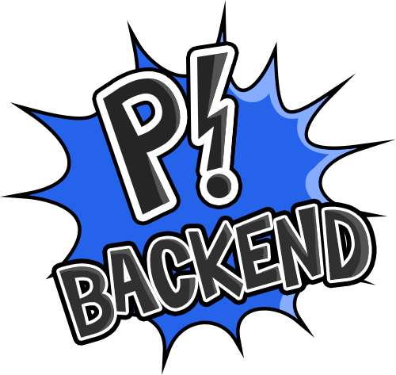

    

> ⚠️ Documentation is still WIP. Expect more updates around May.

# Paddy Backend

This is the business logic component for Paddy, the Power Administration Daemon.

It uses [Quarkus, the Supersonic Subatomic Java Framework](https://quarkus.io/) running Java 17, is written in Kotlin, and is deployed in Docker.

The job of this application is to provide a bridge between the Paddy App && the Daemons. It accomplishes these tasks as such:

1. Exposes a HTTP API to be called by the Paddy App.
2. Connects to a neo4j cluster/standalone DB && stores information regarding the user and Daemons.
3. Interfaces with the Daemons directly by publishing MQTT messages on the broker.